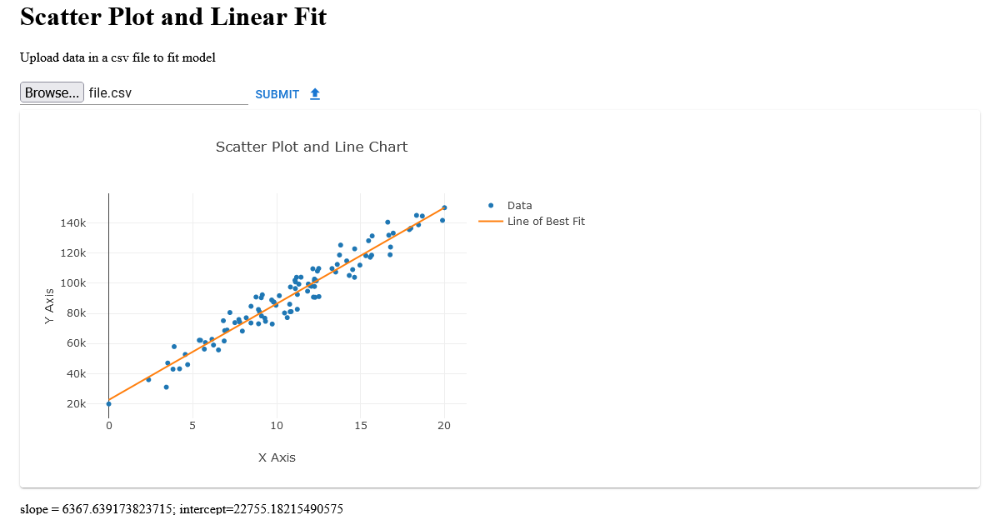

# Frontend UI

The single page web application provides a widget to upload a csv data file. When the file is uploaded and submitted, app 

# Python Flask application 

Provides api to generate linear model for the csv data.


## API Reference

#### Generate linear model

```http
  POST /fitModel
```
`Content-Type: multipart/form-data;`
`Content-Disposition: form-data; name="file"; filename="data.csv"`


## Run Locally

Clone the project

```bash
  git clone https://link-to-project
```

Go to the project directory

```bash
  cd <project>
```

Install dependencies

```bash
  pip install -r requirements.txt
  npm install
```

Run python application
```bash
  python.exe app.py
```

Start the web application

```bash
  npm start
```

## Screenshots



